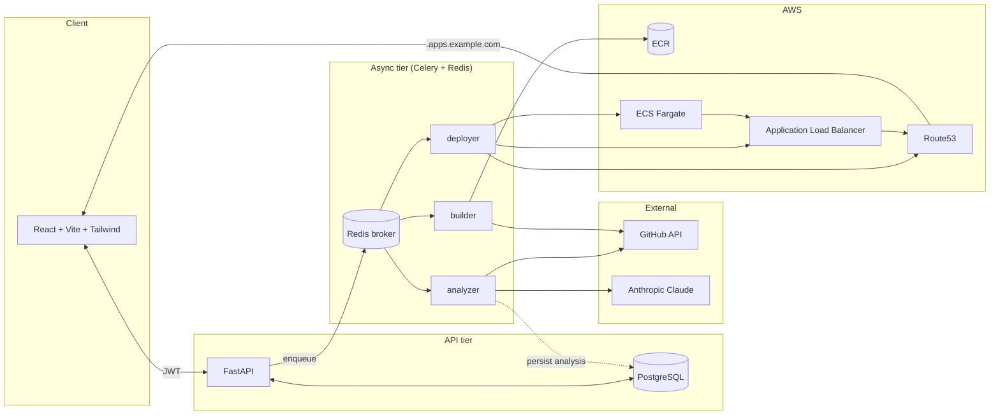

# AI DevOps SaaS

**Paste a GitHub repo URL → an LLM analyzes the framework → a Dockerfile is generated → the app is deployed to AWS ECS Fargate behind a shared ALB at `https://<slug>.apps.example.com` — in under 5 minutes, with no Dockerfile required from the user.**

> **Live demo:** _(coming soon — see [infra/aws/README.md](infra/aws/README.md) for the AWS setup)_
>
> **Walkthrough:** _(60-second screen recording linked here once recorded)_

---

## What it does

1. **User connects a GitHub repo** via OAuth (or signs up with email + password).
2. **Analyzer task** fetches the file tree + manifest files (`package.json`, `pyproject.toml`, `go.mod`, etc.), runs a deterministic detector, then asks **Claude (tool-use, structured output)** to confirm the framework, runtime version, build/start commands, port, and required env vars.
3. **Dockerfile generator** picks a multi-stage template by framework (Next.js standalone, Vite + nginx, FastAPI + uvicorn, Go + distroless, …) and fills it from the analysis.
4. **Build worker** shallow-clones the repo, runs `docker buildx`, and pushes to a per-deployment ECR repo.
5. **Deploy worker** registers an ECS task definition, creates a target group + listener rule on the shared ALB, brings up a Fargate service, waits for ECS-stable + ALB-healthy, then upserts a Route53 ALIAS record.
6. **User gets back a live HTTPS URL.** A `DELETE /deployments/{id}` tears down every AWS resource it created, in reverse order.

## Architecture



## Tech stack

**Backend** FastAPI · async SQLAlchemy 2 · Alembic · Pydantic v2 · Celery · Redis · PostgreSQL 16 · structlog
**Frontend** React 18 · TypeScript · Vite · Tailwind · TanStack Query
**AWS** ECS Fargate · ECR · ALB · Route53 · ACM · IAM · CloudWatch (via boto3)
**AI** Anthropic Claude (Sonnet 4.6, structured tool-use)
**Auth** JWT (HS256) · bcrypt · Fernet (encrypted GitHub tokens at rest) · GitHub OAuth
**Ops** Docker + buildx · GitHub Actions · Alembic migrations

## Repo layout

```
ai-devops-saas/
├── shared/                    # editable Python package, imported by both API and worker
│   ├── shared/
│   │   ├── core/              # config, database, security, logging, slugs
│   │   ├── models/            # User, Repo, Deployment (SQLAlchemy)
│   │   ├── schemas/           # Pydantic request/response
│   │   ├── services/          # github (httpx), anthropic (tool-use)
│   │   ├── analysis/          # detector + LLM analyzer + prompts
│   │   └── docker/            # per-framework Dockerfile templates + dispatch
│   └── alembic/               # single source of truth for migrations
├── backend/                   # FastAPI app
│   ├── app/api/v1/            # auth, repos, deployments routers
│   ├── app/jobs/              # enqueue helpers (send by string name, no worker import)
│   └── tests/
├── worker/                    # Celery workers
│   ├── worker/tasks/          # analyze, build, deploy
│   └── worker/runtime/        # boto3 wrappers (ecr/ecs/elbv2/route53), git, docker
├── frontend/                  # React SPA
├── infra/aws/README.md        # full AWS setup walkthrough (VPC, ALB, IAM, env vars)
├── docker-compose.yml         # local dev: api + worker + postgres + redis + frontend
└── .github/workflows/ci.yml   # install in dep order, ruff, pytest
```

## Local dev

```bash
cp .env.example .env
# fill in GITHUB_CLIENT_ID, GITHUB_CLIENT_SECRET, ANTHROPIC_API_KEY,
# JWT_SECRET, ENCRYPTION_KEY (Fernet)

make up        # docker-compose up - api, worker, db, redis, frontend
make migrate   # alembic upgrade head
```

API: `http://localhost:8000` · Frontend: `http://localhost:5173` · Docs: `http://localhost:8000/docs`

## Tests

```bash
make test                      # full suite
pytest backend/tests/test_detector.py     # framework detection (no LLM, no DB)
pytest backend/tests/test_dockergen.py    # template rendering
pytest backend/tests/test_slugs.py        # DNS/ALB-safe slug rules
```

## Deploying to AWS

The shared backbone (VPC, ALB, ECS cluster, IAM roles, ACM cert, Route53 zone) is one-time Terraform/console setup; per-deployment resources are created and torn down by the worker. Step-by-step: see [`infra/aws/README.md`](infra/aws/README.md).

## Design notes worth calling out

- **Two-stage analysis.** A pure-Python detector handles ~80% of cases for free; the LLM only runs to confirm/disambiguate, with `tool_choice` forcing a structured response. If the LLM fails, we fall back to a heuristic-only result capped at `confidence=0.5` so the downstream can refuse to deploy.
- **Per-deployment ECR repo + slug.** Each deploy gets its own ECR repo and an immutable `:tag` so retention policies and teardowns are cleanly bounded; no cross-deploy tag stomping.
- **ALB + listener rule per deployment.** One shared ALB hosts every user app via host-header rules → free wildcard cert (`*.apps.example.com`) and one ELB cost across the platform.
- **Idempotent teardown.** Every AWS resource the worker creates is recorded by ARN on the Deployment row before any wait. A crashed worker mid-deploy doesn't strand resources — the teardown task uses the recorded ARNs and tolerates `*NotFound` everywhere.
- **At-least-once Celery semantics.** `task_acks_late=True` + `reject_on_worker_lost=True` + idempotent task bodies. A worker dying mid-build redelivers, and the build either picks up where it left off or no-ops (ECR `RepositoryAlreadyExistsException` is treated as success).

## License

MIT.
